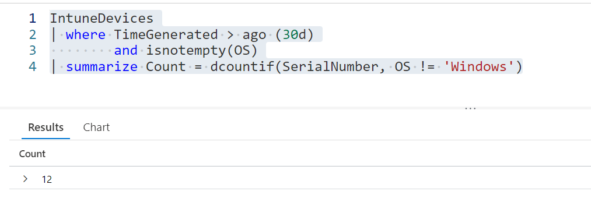

# dcount, dcountif

The **`dcount()`** aggregation function is primarily useful for estimating the cardinality of huge sets

### Estimation accuracy <a href="#estimation-accuracy" id="estimation-accuracy"></a>

The **`dcount()`** aggregate function uses a variant of the [HyperLogLog (HLL) algorithm](https://en.wikipedia.org/wiki/HyperLogLog), which does a stochastic estimation of set cardinality. The algorithm provides a "knob" that can be used to balance accuracy and execution time per memory size:

| Accuracy | Error (%) | Entry count |
| -------- | --------- | ----------- |
| 0        | 1.6       | 212         |
| 1        | 0.8       | 214         |
| 2        | 0.4       | 216         |
| 3        | 0.28      | 217         |
| 4        | 0.2       | 218         |

### dcount

```
IntuneDevices
| where TimeGenerated > ago (30d)
        and isnotempty(OS)
| summarize Count = dcount(SerialNumber, 4)
```

.png>)

### dcountif

```
IntuneDevices
| where TimeGenerated > ago (30d)
        and isnotempty(OS)
| summarize Count = dcountif(SerialNumber, OS != 'Windows')
```


